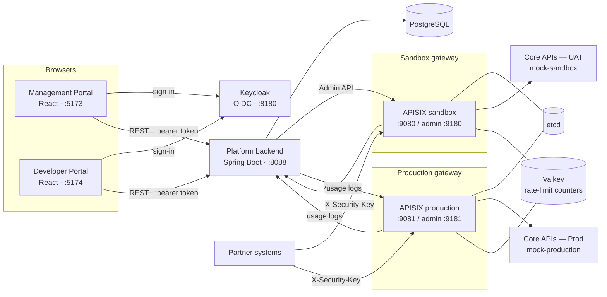

# Architecture

## Responsibilities

| Component | Owns |
|---|---|
| **Platform backend** (`backend-java/`) | System of record: APIs, partners, keys, usage, audit. Enforces the business rules (cooling period, overlap window, tiers) and pushes the result to the gateways. |
| **APISIX gateways** (`infra/`) | Runtime enforcement only. One deployment per environment, so a sandbox credential never exists on Production. |
| **Keycloak** | No longer used for portal sign-in (that is e-mail OTP inside the platform). Kept in the compose file for the partner token APIs planned under DP-06. |
| **Sign-in** | CAPTCHA plus a one-time code e-mailed to the user, handled by the backend's `auth` package; the session is an HS256 token the platform signs and verifies itself, carrying the same claims the Keycloak token used to. |
| **Portals** (`frontend/`) | Two React apps sharing `@apigw/ui`: design tokens from the screen designs, API client, sign-in, key components. |

## How a security key works end to end (BRD v1.3)

1. The partner (or an Admin) calls `POST /api/partner/keys/SANDBOX`.
2. The backend generates `agw_sbx_` + 256 random bits and stores **only** its SHA-256 hash and a masked form.
3. Any previous key becomes `EXPIRING` with `expires_at = now + 20 min`. While a window is open, no further key can
   be generated, which keeps the two-key maximum.
4. The backend registers the **hash** as a `key-auth` credential under the partner's consumer (its Client ID) on the
   Sandbox gateway only.
5. The plaintext goes back in that one HTTP response and is never available again.
6. On each call, the gateway's `serverless-pre-function` hashes the presented `X-Security-Key` before `key-auth`
   compares it, so the gateway also never holds a usable key.
7. `limit-count` counts per consumer name, which is the Client ID, so old and new keys share one allowance.
8. `KeyExpiryJob` runs every 15 seconds; when a window ends, the old credential is deleted from the gateway and the
   key is marked `EXPIRED`, audited as "System".

## Known gaps before production

- **Gateway integration has not been run against a live APISIX yet.** The payloads are unit-tested
  (`ApisixConfigFactoryTest`), but this machine had no container runtime running. First task on a machine with Docker:
  `docker compose up`, then the smoke test in the README.
- **GW-02 token check** at the gateway is not configured yet (the key is checked; the bearer token is not).
- **Expiry depends on the backend's scheduler.** If the backend is down when a window ends, the old key keeps working
  until it is back. For production, also enforce expiry in the gateway (e.g. credential labels checked by a plugin).
- **Dev sign-in** (`X-Dev-*` headers) exists for local work only and refuses to start under the `prod` profile.
- **APISIX `data_encryption` keyring** in `infra/apisix/config.yaml` is a demo value.
