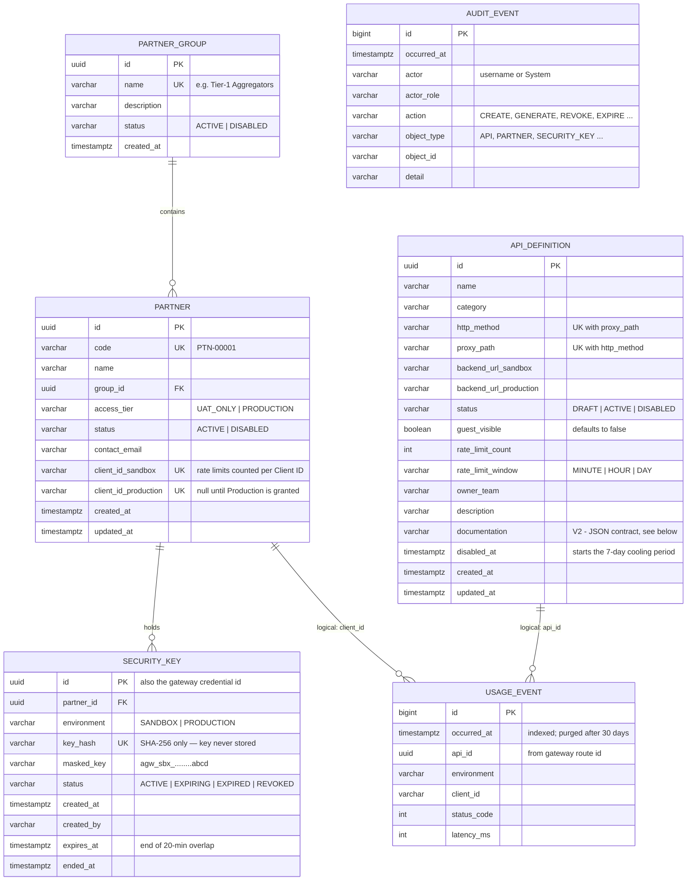
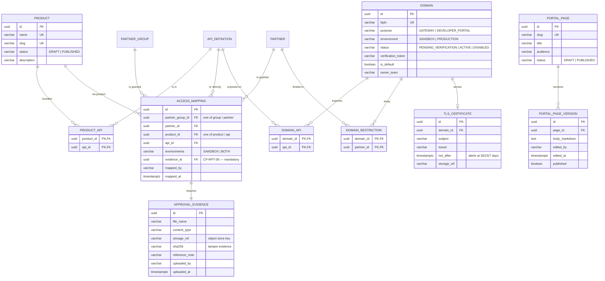

# Database — entity-relationship diagram

PostgreSQL schema for the control plane (the Management Portal and Developer Portal backend).
The gateways keep their own runtime configuration in etcd; this database is the system of record
that the backend pushes to them.

- **Implemented** tables come from `backend/src/main/resources/db/migration/V1__baseline.sql` and
  `V2__api_documentation.sql`.
- **Planned** tables cover the BRD modules not yet built (Products, access mapping, domains, portal pages).
  Column lists for planned tables are a design proposal, to be confirmed when each module is built.

## Implemented (migrations V1, V2)



`USAGE_EVENT` and `AUDIT_EVENT` are append-only and deliberately carry no foreign keys: usage rows must
survive an API being deleted, and audit rows must survive anything.

### API documentation (CP-API-06, CP-API-07)

Each API's contract is stored as one JSON document in `api_definition.documentation` (up to 200,000 characters),
not as child tables. The contract is always read and written whole: by the editor in the Management Portal,
by the Swagger / OpenAPI / Postman importer, and by the Developer Portal's API page and *Try it live* console.
One column means one row version per edit and no joins on the partner-facing read path.

```json
{
  "source": "MANUAL | OPENAPI | POSTMAN",
  "queryParameters":   [{ "name": "accountNumber", "type": "string", "required": true, "example": "...", "description": "..." }],
  "requestHeaders":    [ "...same field shape..." ],
  "requestBodyFields": [ "...same field shape; dotted names for nesting, e.g. payee.ifsc..." ],
  "requestBodyExample": "{ ... }",
  "responseHeaders":   [ "...same field shape..." ],
  "responses": [
    { "statusCode": 200, "description": "Accepted", "bodyExample": "{ ... }", "bodyFields": [] },
    { "statusCode": 409, "description": "Duplicate X-Request-Id", "bodyExample": "{ ... }", "bodyFields": [] }
  ]
}
```

The backend validates it on every save: every row needs a name, and status codes must be 100-599 and unique per API.
If documentation later needs search across APIs or per-field history, split it into endpoint / field / return-code
tables. On PostgreSQL the column can also become `jsonb` with a GIN index without changing the application.

## Planned (remaining BRD modules)



## Notes for production

- **Usage volume.** At ~5 million calls a day, `usage_event` holds ~150 million rows at the 30-day retention limit.
  Before go-live, convert it to monthly range partitions (`pg_partman`, supported on Amazon RDS) so retention
  becomes a partition drop rather than a `DELETE`, or move analytics to ClickHouse / TimescaleDB.
- **Keys.** `key_hash` is unique, so a hash collision or a replayed key cannot be registered twice. The plaintext
  key exists only in the HTTP response that created it (BRD v1.3, CP-SEC-08/09).
- **Audit.** For tamper evidence, add a hash chain column (each row stores the hash of the previous row), or ship
  rows to a WORM archive, depending on what your Information Security team requires.
